# Azure Resource Group Deployment

## Project Overview

This project demonstrates how to create a **Resource Group in Microsoft Azure**. Resource Groups act as containers that organize and manage related Azure resources such as **Virtual Machines, storage accounts, networking components, and other services**.

In this walkthrough, we will:

- Create a free Microsoft Azure account
- Access the Azure Portal
- Locate the Resource Groups service
- Create a new Resource Group
- Verify the Resource Group deployment
- Create a Windows Virtual Machine within the Resource Group
- Access the Virtual Machine using Remote Desktop Protocol (RDP)

---

# Demonstration

## Step 1 – Create a Free Microsoft Azure Account

Before deploying any cloud resources, you must first create a **Microsoft Azure account**.

Visit the official Microsoft Azure website below:

**Azure Free Account:**  
https://azure.microsoft.com/free/

Follow the instructions to:

- Sign in with a Microsoft account or create one
- Verify your identity
- Complete the free account registration

After the account is created, log in to the **Azure Portal**.

---

## Step 2 – Search for Resource Groups in Azure

After logging into the **Azure Portal**, locate the **search bar at the top of the page**.

Type **Resource Groups** into the search bar.

From the search results, select **Resource Groups**.

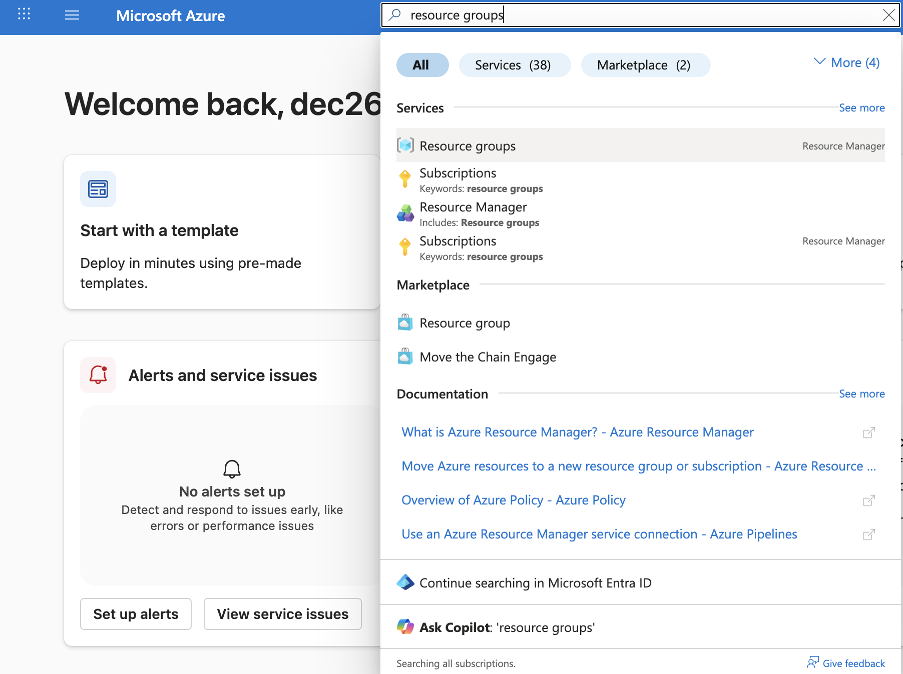

---

## Step 3 – Open the Resource Groups Dashboard

The **Resource Groups dashboard** will now open.

This page displays all Resource Groups associated with your Azure subscription. If this is a new account, the page will show that **no resource groups currently exist**.

Click the **Create** button to start creating a new Resource Group.

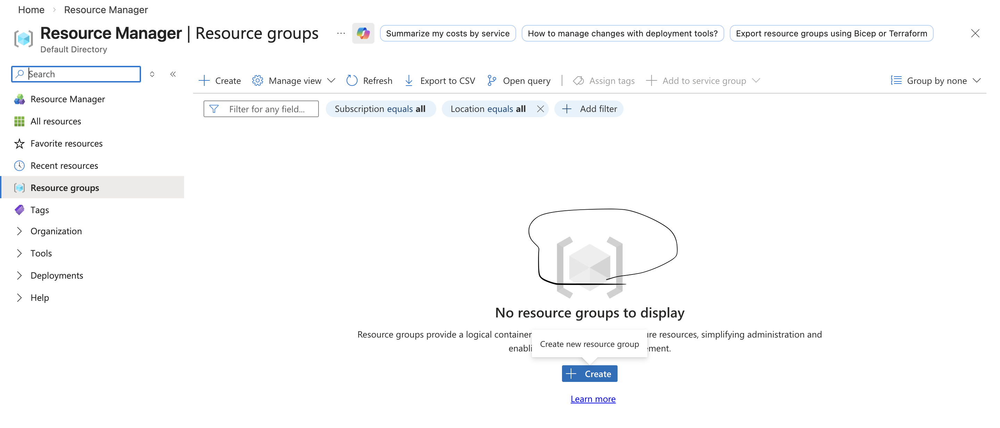

---

## Step 4 – Configure the Resource Group

The **Create a Resource Group** configuration page will now appear.

Enter the following settings:

**Subscription:** Azure subscription 1  
**Resource Group Name:** osTicket  
**Region:** Central US

After entering the information, click **Review + Create**.

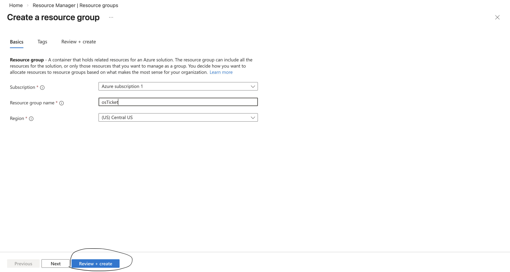

---

## Step 5 – Review the Resource Group Settings

Azure will display a **Review + Create** page showing the configuration details.

Confirm that the following settings are correct:

- Subscription
- Resource Group Name
- Region

Once verified, click **Create** to deploy the Resource Group.

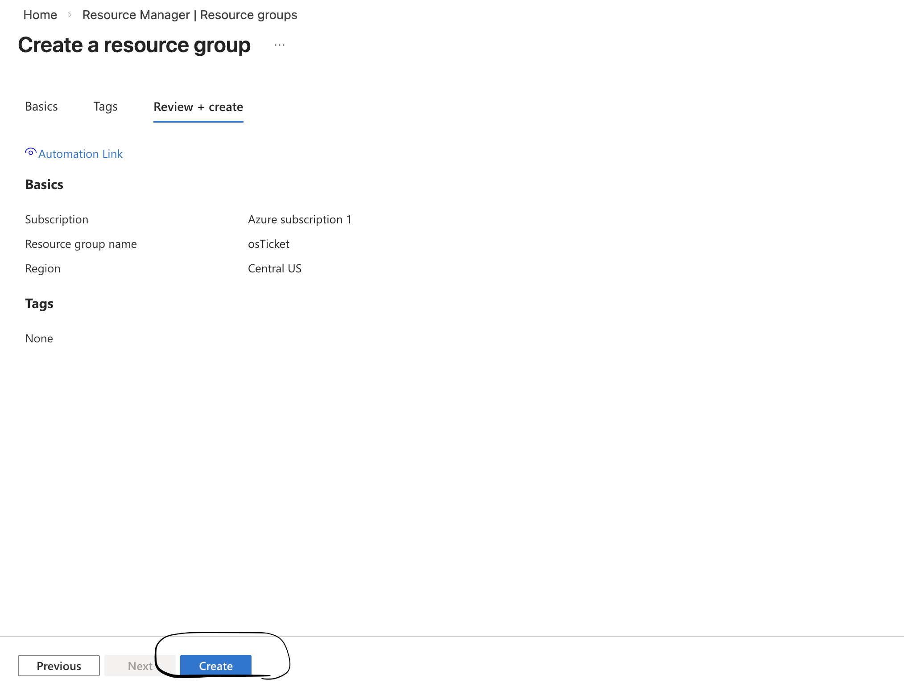

---

## Step 6 – Verify the Resource Group Deployment

After the deployment process completes, return to the **Resource Groups dashboard**.

You should now see the newly created Resource Group listed.

In this example, the **osTicket Resource Group** has been successfully created and is ready to host Azure resources.

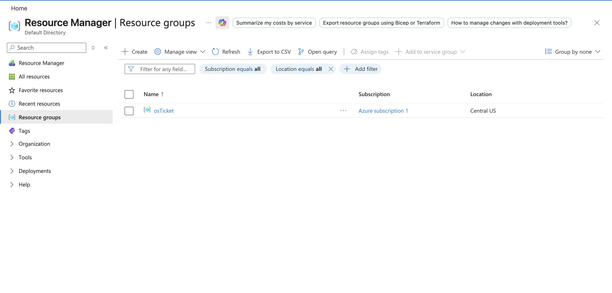

---
---

# Creating an Azure Virtual Machine

After creating the Resource Group, the next step is to deploy a **Virtual Machine (VM)** inside that Resource Group. Virtual Machines allow you to run operating systems and applications in the cloud just like a physical computer.

---

## Step 7 – Search for Virtual Machines

At the top of the Azure Portal, locate the **search bar**.

Type **Virtual Machines** into the search field.

From the results list, select **Virtual Machines**.

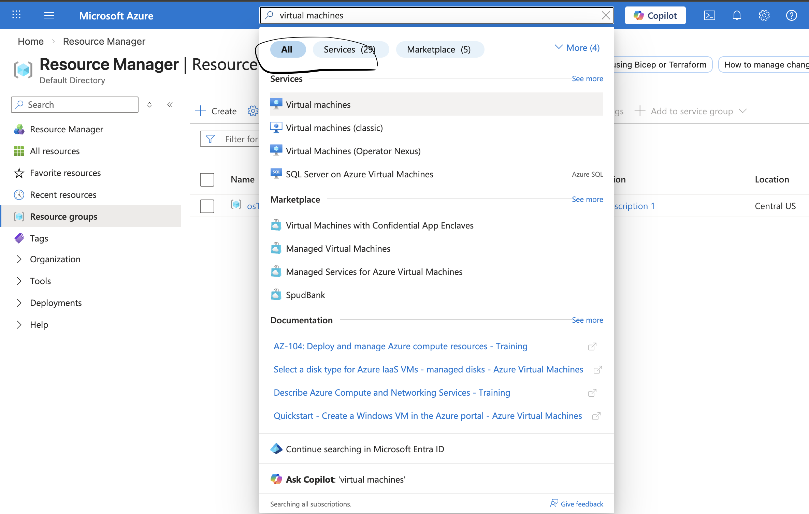

---

## Step 8 – Open the Virtual Machines Dashboard

The **Virtual Machines dashboard** will now open.

If no virtual machines have been created yet, the page will display **No virtual machines to display**.

Click the **Create** button to begin creating a new virtual machine.

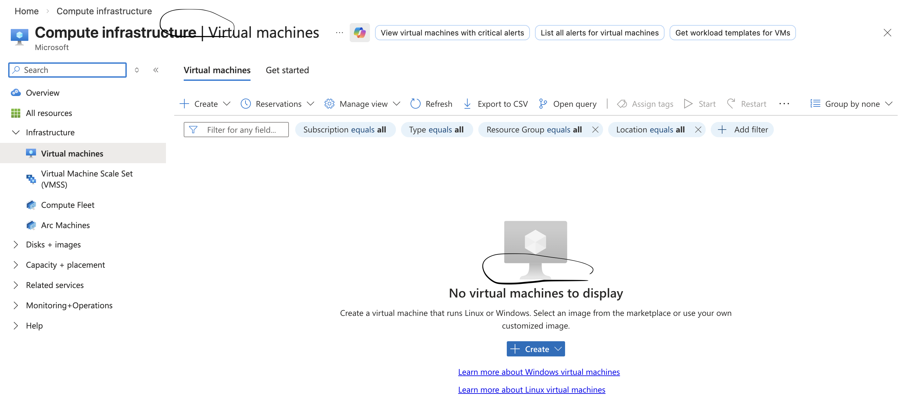

---

## Step 9 – Select Virtual Machine Deployment

After clicking **Create**, a dropdown menu will appear with several options.

Select **Virtual Machine** to begin the virtual machine deployment process.

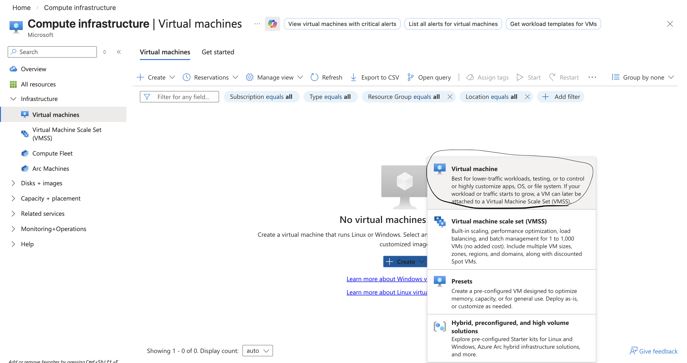

---

## Step 10 – Select the Resource Group

The **Create a Virtual Machine** configuration page will open.

Under **Project Details**, locate the **Resource Group** field.

Select the previously created Resource Group named **osTicket**.

This ensures the virtual machine will be organized inside the correct resource container.

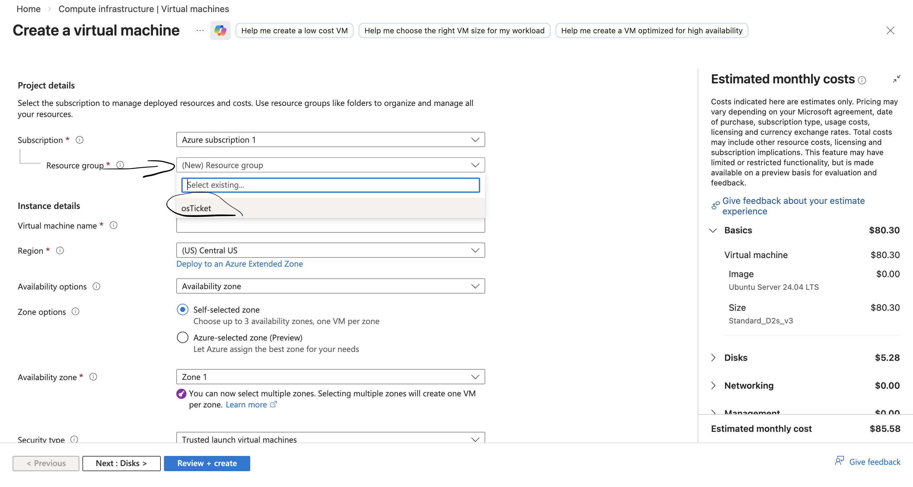

---

## Step 11 – Configure Virtual Machine Basics

Next, configure the **Instance Details** for the virtual machine.

Enter the following information:

**Virtual Machine Name:** osTicket-Proj  
**Region:** Central US

These settings determine the name of the machine and the geographic region where it will be deployed.

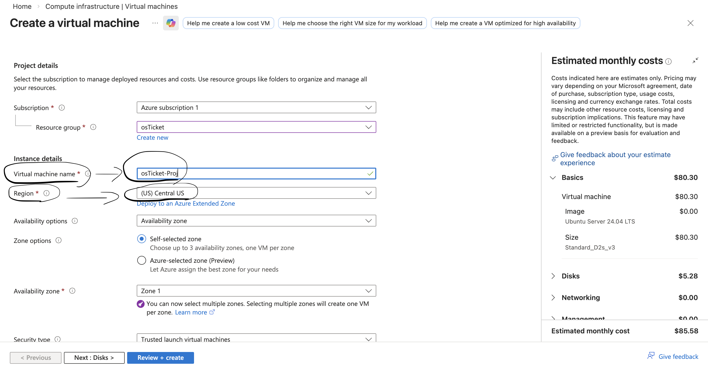

---

## Step 12 – Configure Availability and VM Size

Continue configuring the virtual machine settings.

Set the following options:

**Availability Options:** Availability zone  
**Zone Options:** Self-selected zone  
**Availability Zone:** Zone 1

For the virtual machine size, select:

**Size:** Standard_D2s_v3  
(2 vCPUs, 8 GB RAM)

This size provides enough resources for the project while keeping costs relatively low. 
Cost to the right is only if the VM is running the entire month.
We will only be using the VM for a limited time.

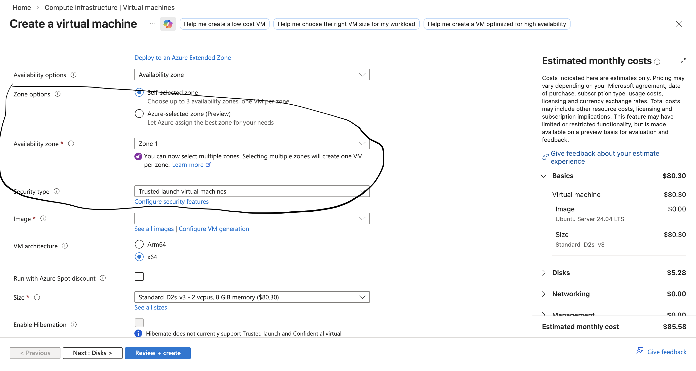

---

---

# Step 13 – Select the Virtual Machine Image

Under **Image**, click the dropdown menu to view available operating systems.

From the list of available images, select:

**Windows 11 Pro, version 25H2 – x64 Gen2**

This image will install Windows 11 on the virtual machine.

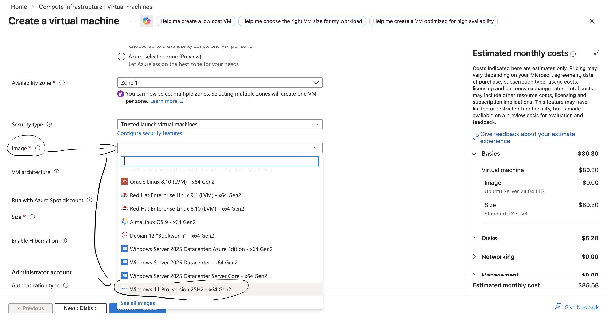

---

# Step 14 – Select the Virtual Machine Size

Next, locate the **Size** option.

Click the dropdown menu and select:

**Standard_D2s_v3 – 2 vCPUs, 8 GiB Memory**

This VM size provides enough computing resources to run the project while keeping costs manageable.

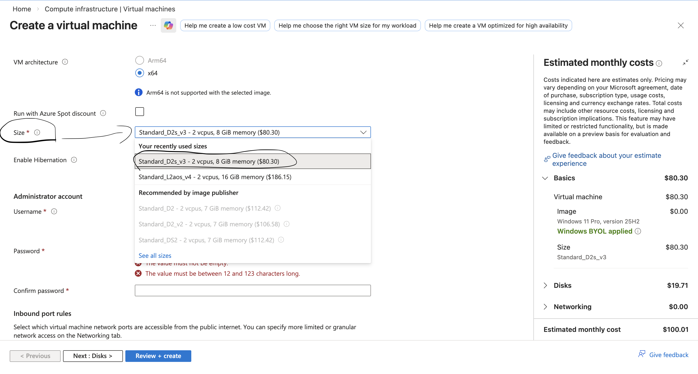

---

# Step 15 – Configure Administrator Credentials

Under **Administrator account**, create login credentials for the virtual machine.

Enter the following:

**Username:** Create a username of your choice  
**Password:** Create a secure password  
**Confirm Password:** Re-enter the same password

These credentials will later be used to log into the virtual machine using Remote Desktop.

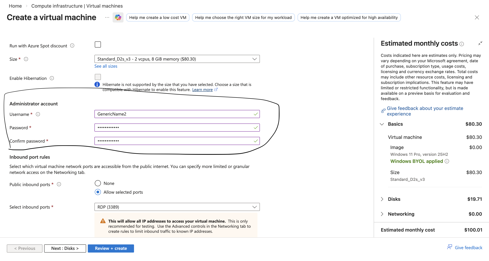

---

# Step 16 – Configure Licensing and Ports

Scroll down to the **Licensing** section.

Check the box confirming that you have an eligible Windows license:

✔ **I confirm I have an eligible Windows 10/11 license with multi-tenant hosting rights**

Under **Public inbound ports**, ensure the following option is selected:

**Allow selected ports**

For **Select inbound ports**, choose:

**RDP (3389)**

This allows the virtual machine to be accessed using Remote Desktop.

Click **Next: Disks** to continue.

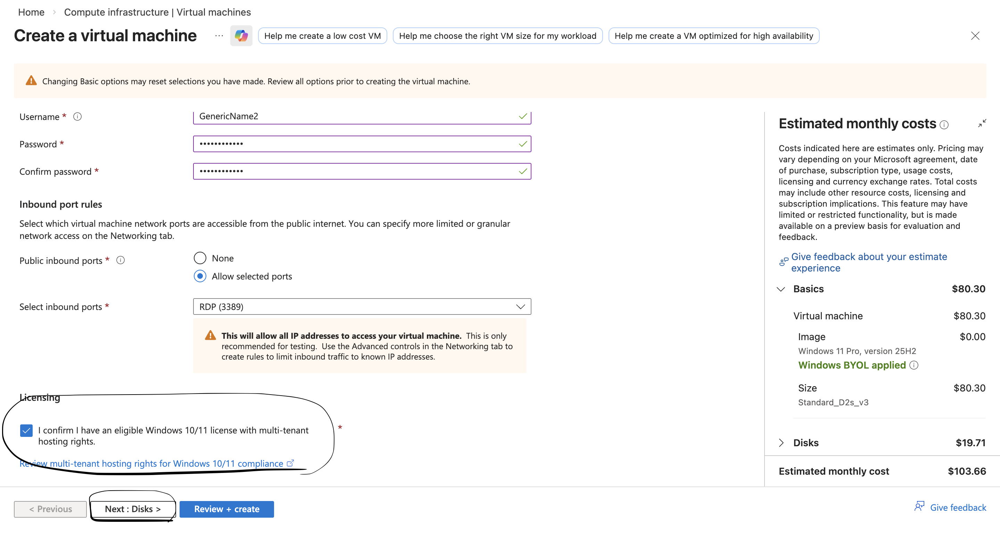

---

# Step 17 – Configure Disk Settings

The **Disks** tab controls the storage used by the virtual machine.

Leave the default settings as they are:

**OS Disk Size:** Image default (127 GiB)  
**OS Disk Type:** Premium SSD

After confirming the settings, click **Next: Networking**.

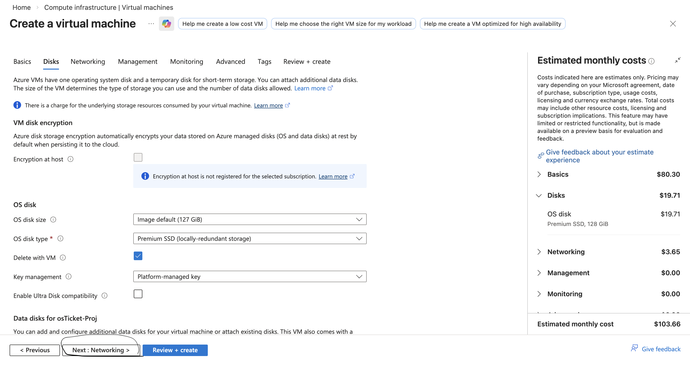

---

# Step 18 – Configure Networking

The **Networking** tab configures how the virtual machine connects to the internet.

Confirm the following default settings:

**Virtual Network:** (new) osTicket-Proj-vnet  
**Subnet:** default (10.0.0.0/24)  
**Public IP:** (new) osTicket-Proj-ip

Ensure **Public inbound ports** is set to:

**Allow selected ports**

And verify **RDP (3389)** is selected.

Once everything is confirmed, click **Review + create**.

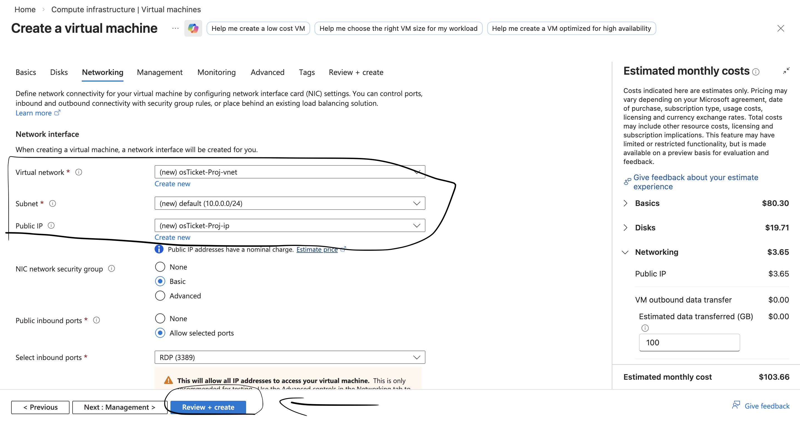

---

# Step 19 – Create the Virtual Machine

After reviewing all configuration settings, scroll to the bottom of the page.

Click the **Create** button to begin deploying the virtual machine.

Azure will now begin provisioning the virtual machine and all required resources.

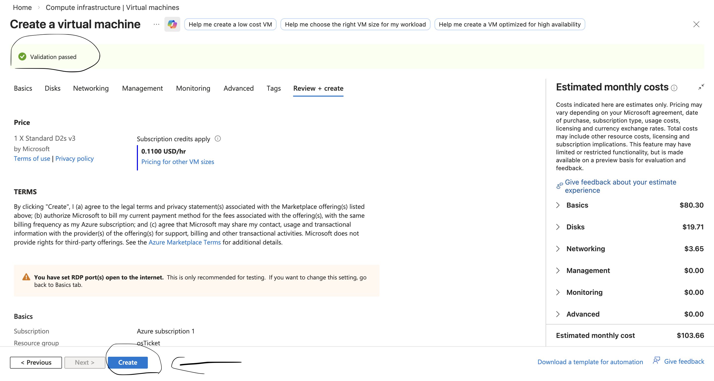

---

# Step 20 – Deployment in Progress

After clicking **Create**, Azure will begin the deployment process.

A deployment screen will appear showing that the virtual machine and supporting resources are being created.

During this process Azure automatically creates resources such as:

- Virtual Network
- Network Security Group
- Public IP Address

This process may take several minutes to complete.

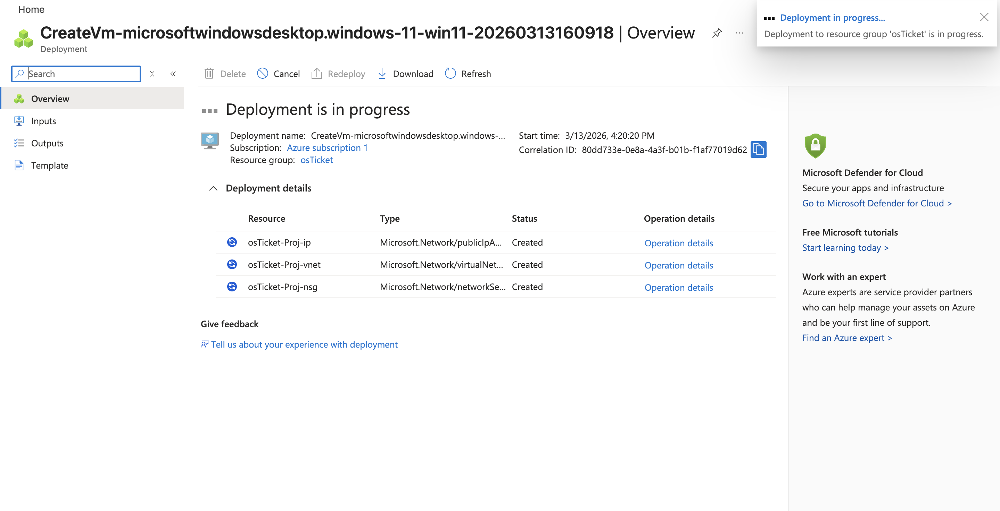

---

# Step 21 – Deployment Complete

Once Azure finishes creating the resources, the deployment page will display a message stating:

**Your deployment is complete**

This confirms that the virtual machine has been successfully created and is ready to use.

From this page you can click **Go to resource** to view the virtual machine.

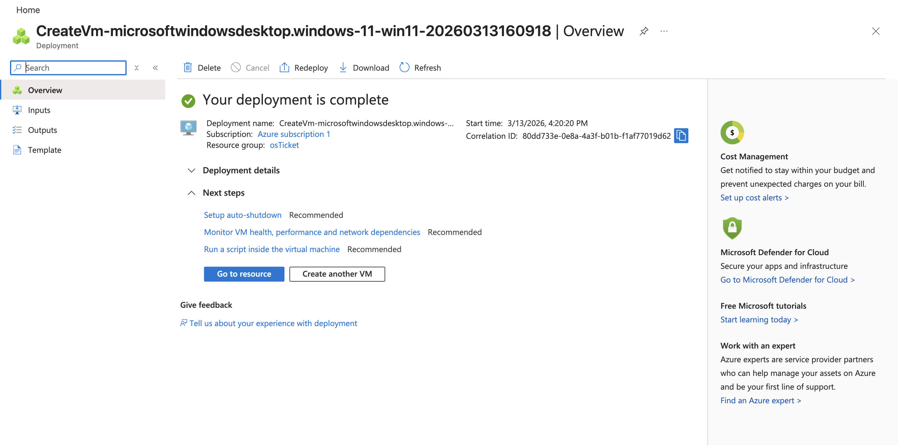

---

# Step 22 – Verify the Virtual Machine

To verify the virtual machine exists, return to the Azure search bar at the top of the portal.

Type **Virtual Machines** into the search field.

Select **Virtual Machines** from the results list.

This will open the Virtual Machines dashboard where you can view and manage the virtual machine that was just created.

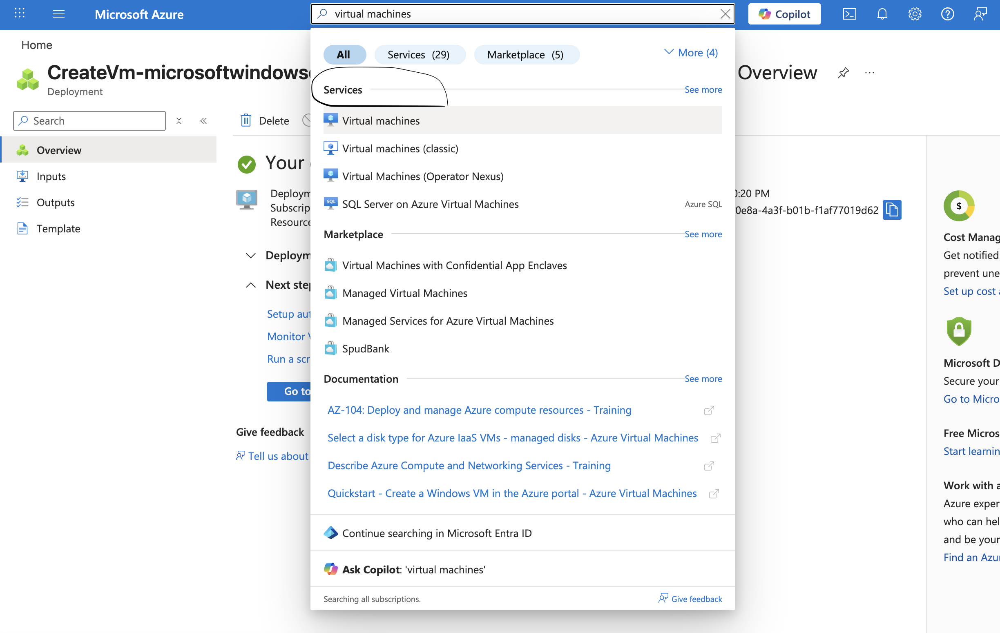

---

# Step 23 – Confirm the Virtual Machine is Running

Return to the **Virtual Machines** dashboard in the Azure portal.

Locate the virtual machine you created and confirm that the **Status** shows **Running**.  
You will also see the **Public IP Address** assigned to the virtual machine. This IP address will be used to connect to the machine remotely.

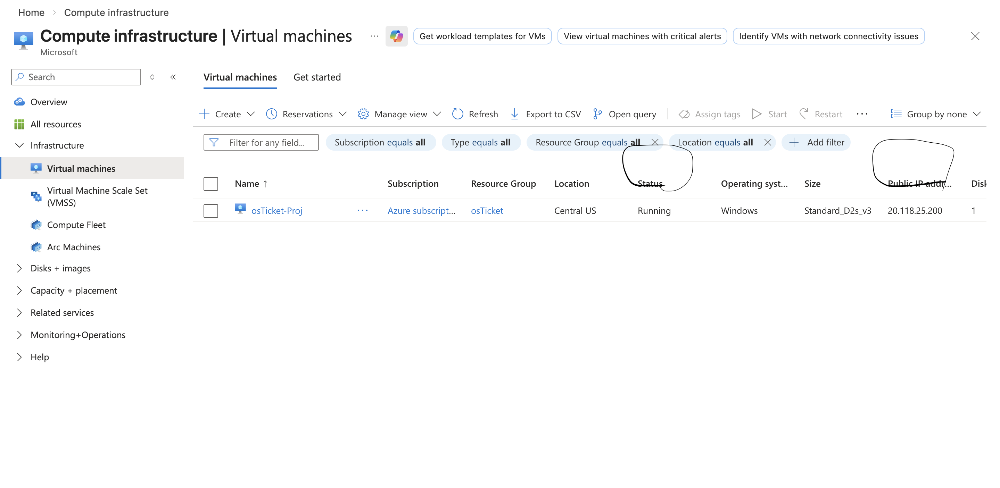

---

# Step 24 – Open Spotlight Search (Mac Users)

If you are using **macOS**, open **Spotlight Search** by pressing:

Command (⌘) + Space

Then search for **App Store** and open it.

> **Note:**  
> Windows users can simply open the **Start Menu** and search for **Remote Desktop**. The Remote Desktop client is already installed on Windows systems.

---

# Step 25 – Search for the Windows App

Inside the **App Store**, search for:

Windows App

This application (formerly **Microsoft Remote Desktop**) allows macOS users to remotely connect to Windows systems such as the Azure virtual machine created earlier.

Install or open the application.

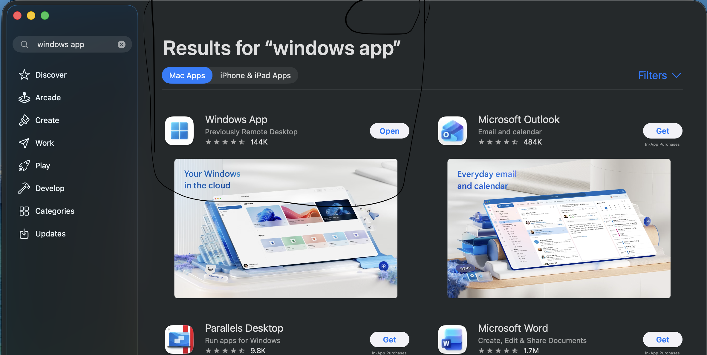

---

# Step 26 – Launch the Windows App

After installing the application, open **Spotlight Search** again.

Search for:

Windows App

Then launch the application.

---

# Step 27 – Add the Virtual Machine

Inside the **Windows App**, click the **+** icon located in the top-right corner.

From the dropdown menu select:

Add PC

This option allows you to create a new remote connection.

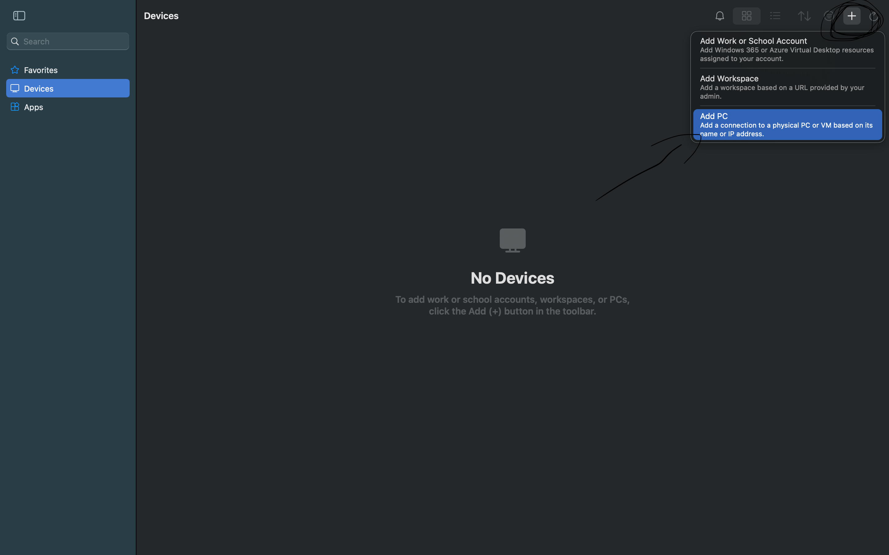

---

# Step 28 – Enter the Virtual Machine Public IP Address

A configuration window will appear.

In the **PC name** field, enter the **Public IP Address** of your Azure virtual machine.

You can find this IP address from the **Virtual Machines dashboard** shown in Step 23.

Leave the remaining settings as default and click **Add**.

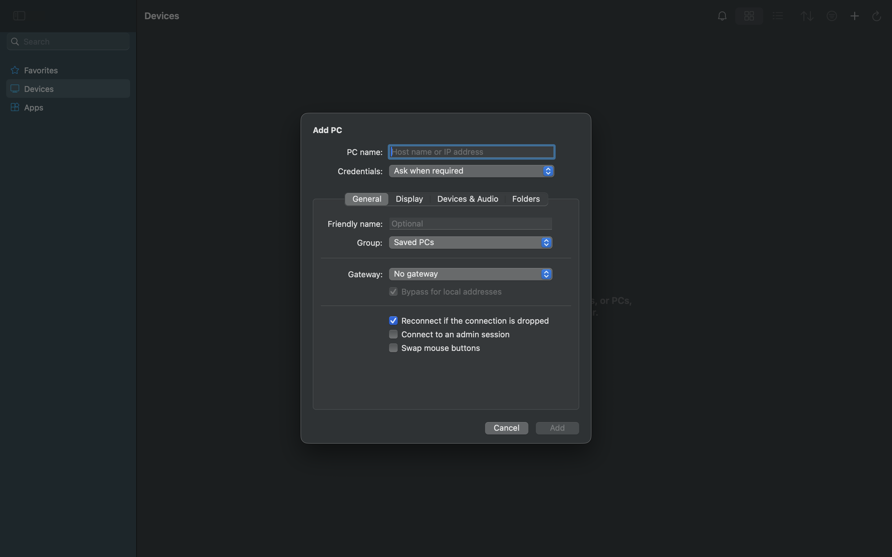

---

# Step 29 – Locate the Virtual Machine Public IP Address

Return to the **Virtual Machines** page in the Azure Portal.

Find the virtual machine you created (`osTicket-Proj`) and locate the **Public IP Address** in the table.

Copy this IP address because you will use it to remotely connect to the VM.

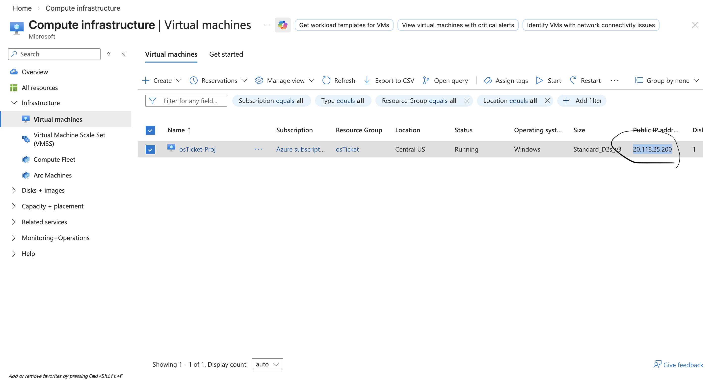

---

# Step 30 – Add the Azure VM to Windows App

Open the **Windows App** (Microsoft Remote Desktop) on your computer.

Click **Add PC** and configure the connection:

• **PC name:** Paste the Public IP Address from Azure  
• **Friendly name:** osTicket  

Leave the remaining settings as default.

Click **Add**.

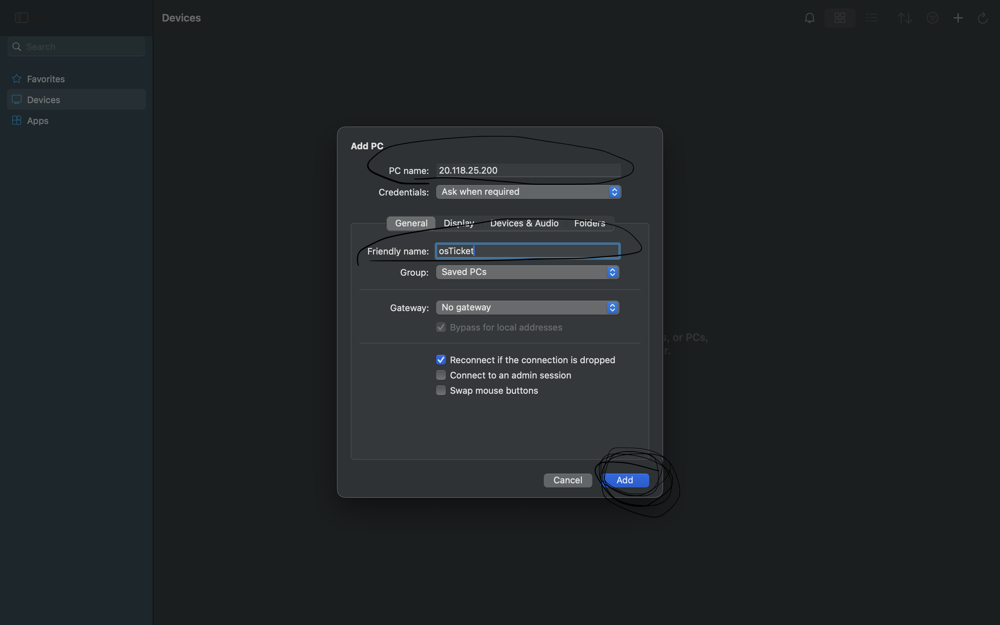

---

# Step 31 – Confirm the Remote Connection Was Added

After adding the PC, it will appear inside the **Saved Devices** section.

You can now click the connection the VM labeled **osTicket**.

Click the connection to start the remote desktop session.

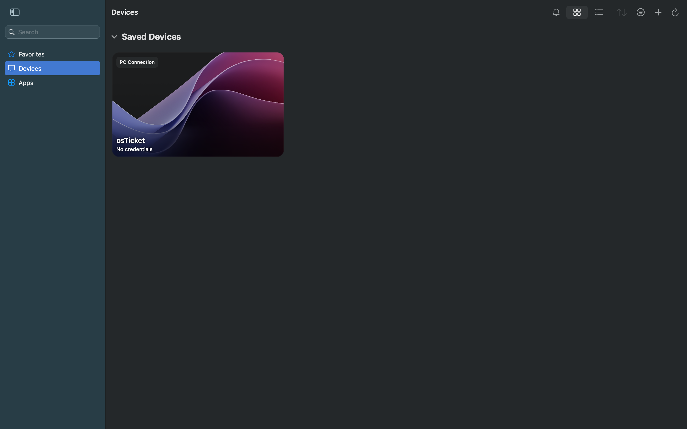

---

# Step 32 – Enter Your Virtual Machine Credentials

A login window will appear.

Enter the **username and password** that you created earlier when configuring the Azure virtual machine.

Then click **Continue**.

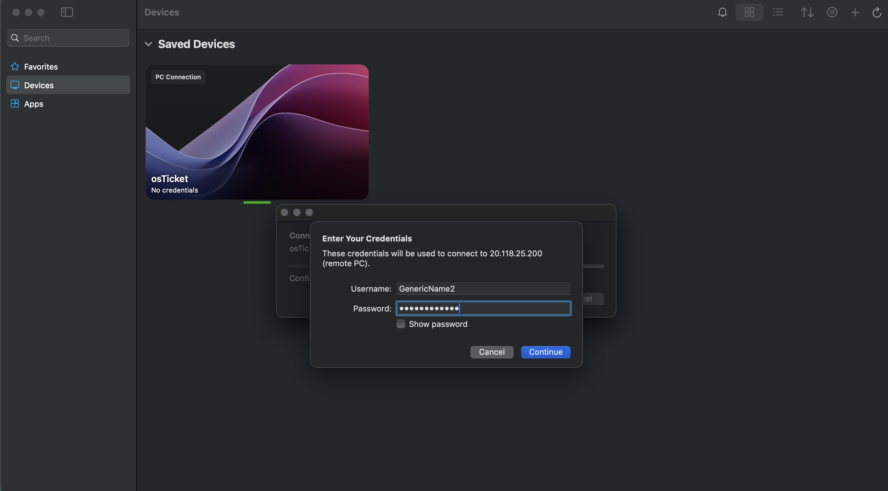

---

# Step 33 – Accept the Certificate Warning

When connecting for the first time, you may see a certificate verification warning.

Click **Continue** to proceed with the connection.

This message appears because the VM is using a self-signed certificate.

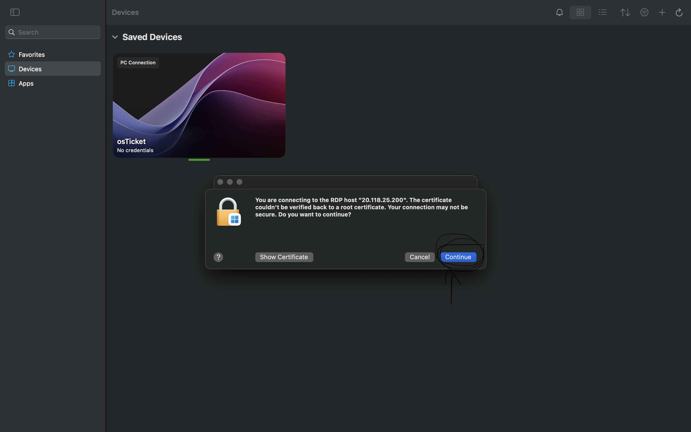

---

# Step 34 – Successfully Connect to the Virtual Machine

After logging in, the Windows virtual machine will begin loading.

You will see the **Windows login screen** for the VM user account.

This confirms that the remote desktop connection to your Azure VM was successful.

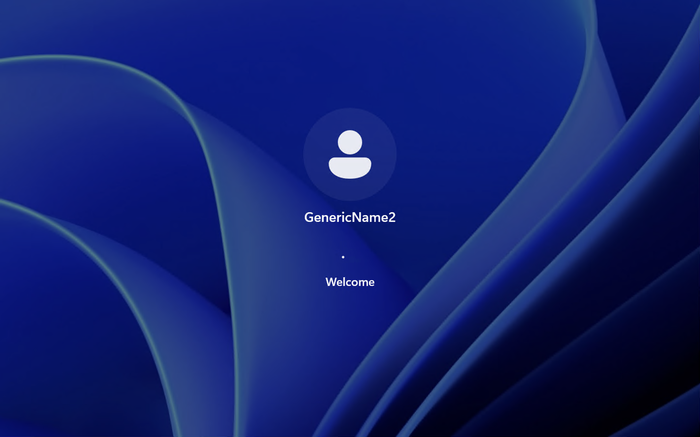

---

# Step 35 – Configure Windows Privacy Settings

After logging into the virtual machine for the first time, Windows will ask you to configure privacy settings.

Review the options on the screen and click **Next** to continue.

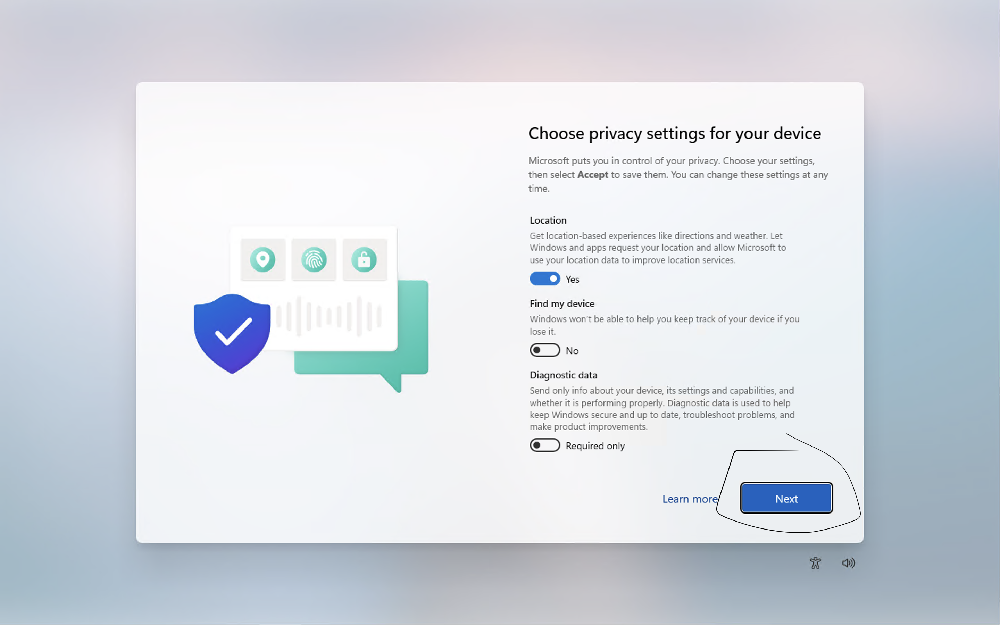

---

# Step 36 – Accept the Privacy Settings

Scroll through the remaining privacy options.

Once finished, click **Accept** to complete the configuration.

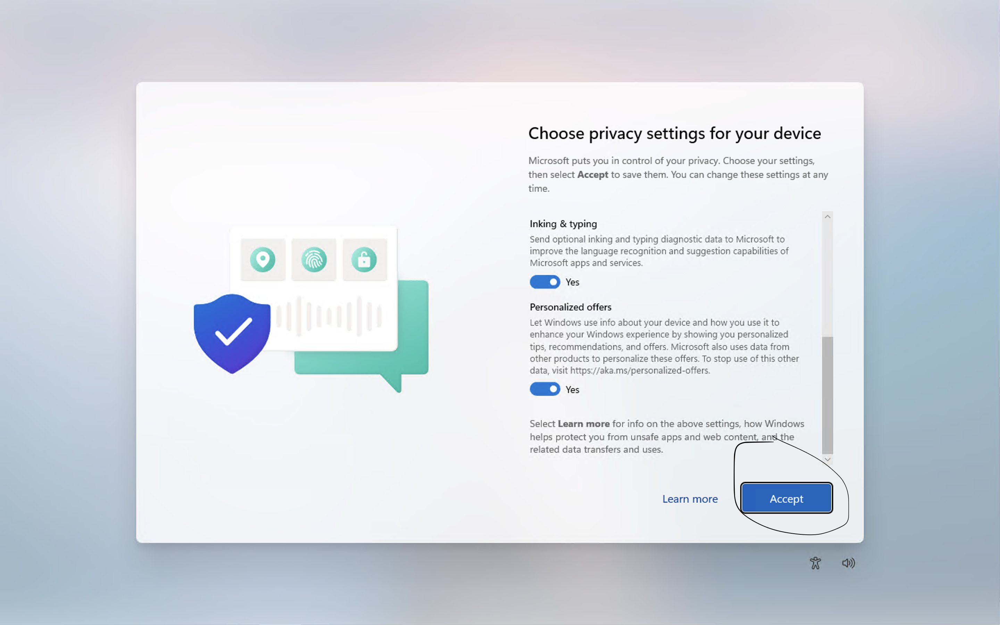

---

# Step 37 – Access the Windows Desktop

After accepting the privacy settings, the Windows desktop will load.

You are now successfully logged into your **Azure Virtual Machine**.

At this point you should see the Windows desktop with default applications such as **Microsoft Edge** and **Recycle Bin**.

---

# Step 38 – Stop the Virtual Machine When Finished

To avoid unnecessary Azure charges, return to the **Azure Portal** when you are finished using the VM.

Navigate to:

Virtual Machines → Select **osTicket-Proj**

Click the **Stop** option from the toolbar.

This will deallocate the VM and stop billing for compute resources.

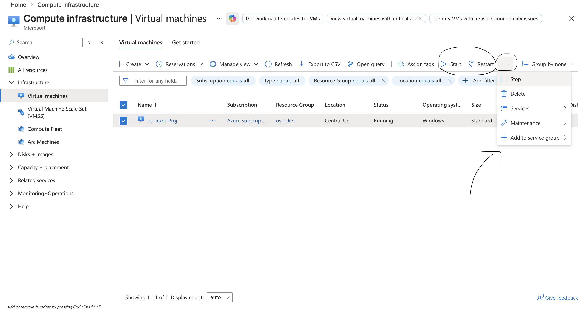

---

# Step 39 – Verify the Virtual Machine Has Stopped

After stopping the VM, click **Refresh** on the Virtual Machines page.

Confirm that the **Status** now shows:

Stopped (deallocated)

This confirms that the VM is no longer running and billing has stopped.

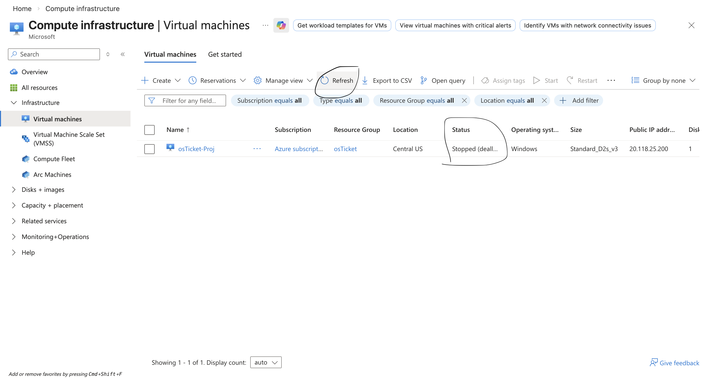

---

# Final Summary

In this lab you successfully:

• Created a Microsoft Azure account  
• Created a Resource Group  
• Deployed a Windows 11 Virtual Machine  
• Connected to the VM using Remote Desktop  
• Logged into the Windows environment  
• Properly stopped the VM to prevent unnecessary charges  

The Azure virtual machine environment is now ready for the next stage of the project: **Installing and configuring osTicket.**

